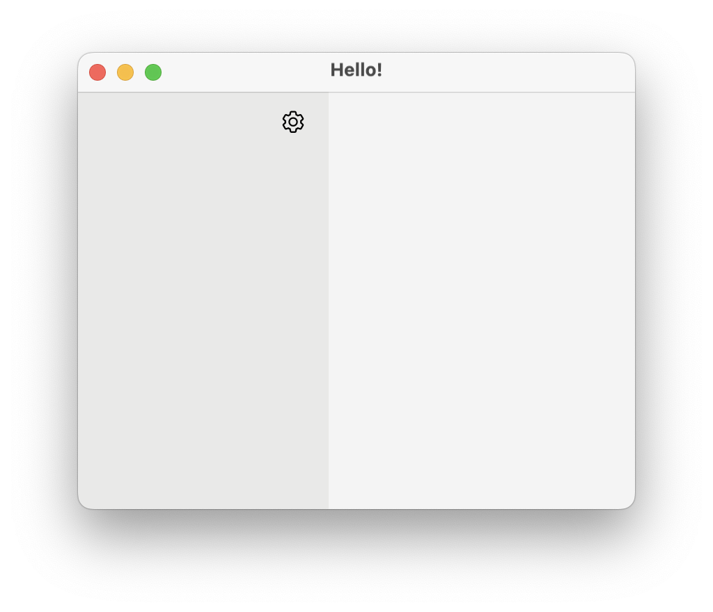
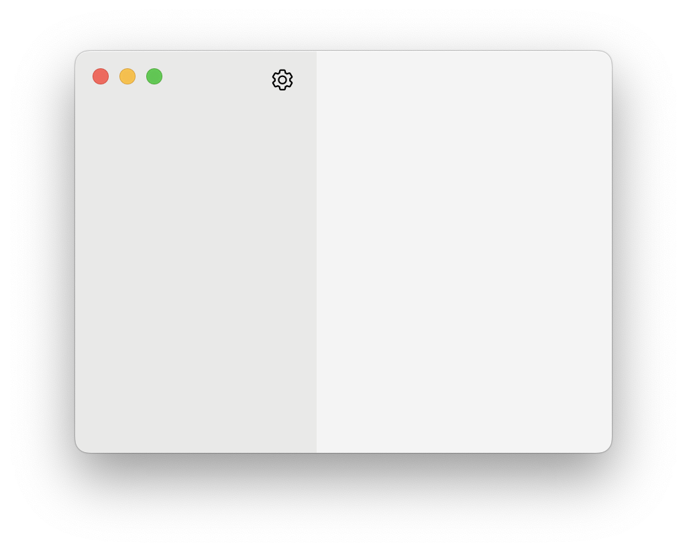

# JavaFX Transparent Title Bar on macOS

This is a demo on how to change JavaFX stage to make the title bar transparent in macOS so the window
looks like modern macOS apps. The demo uses Java Foreign Function and Memory API to avoid writing any native code.

> [!WARNING]  
> The demo uses reflection to access non-public JavaFX API to get the native handle of NSWindow. This code might
> break in future versions of JavaFX

|                 Standard Stage                 |             Transparent Titlebar Stage             |
|:----------------------------------------------:|:--------------------------------------------------:|
|  |  |
